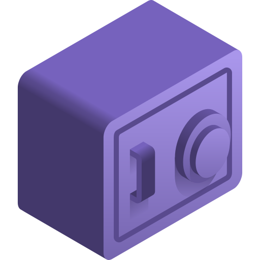

<div id="top"></div>

<!-- PROJECT SHIELDS -->
<!--
*** I'm using markdown "reference style" links for readability.
*** Reference links are enclosed in brackets [ ] instead of parentheses ( ).
*** See the bottom of this document for the declaration of the reference variables
*** for contributors-url, forks-url, etc. This is an optional, concise syntax you may use.
*** https://www.markdownguide.org/basic-syntax/#reference-style-links
-->
[![LinkedIn][linkedin-shield]][linkedin-url]
[![Contributors][contributors-shield]][contributors-url]
[![Stargazers][stars-shield]][stars-url]
[![Issues][issues-shield]][issues-url]


<!-- PROJECT LOGO -->
<br />
<div align="center">
  <a href="https://github.com/ryanbender2/rent-helper-myfirstproject">
    
  </a>

<h3 align="center">Rent Helper</h3>

  <p align="center">
    My First Project
  </p>
</div>


<!-- TABLE OF CONTENTS -->
<details>
  <summary>Table of Contents</summary>
  <ol>
    <li>
      <a href="#about-the-project">About The Project</a>
      <ul>
        <li><a href="#built-with">Built With</a></li>
      </ul>
    </li>
    <li><a href="#history">History</a></li>
    <li><a href="#contact">Contact</a></li>
    <li><a href="#acknowledgments">Acknowledgments</a></li>
  </ol>
</details>


<!-- ABOUT THE PROJECT -->
## About The Project

[![Rent Helper Screen Shot][product-screenshot]](https://github.com/ryanbender2/rent-helper-myfirstproject)

<strong>Hello there.</strong>
<p>However you got here, thanks for being here, I'm glad to have you. What you're looking at here is my first ever project. Complete with no project structure, a misunderstanding of technologies, and a whole lot of enthusiasm to learn about programming.
In the summer of 2019, I found myself working as a cyber security intern a small business. At the time, I didn't really have any interest in programming, I knew of it, but barely. I was interested in hacking, but with that came the necessity of learning how to code. A mentor of mine at school told me over a dinner, "If you want to be a hacker, you have to learn to code. There's no way around it." I didn't really know what to make of it at the time, but I figured...alright, I guess I'll need to learn that at some point. This didn't mean anything to me at my internship until I was given a small 'coding' project.</p>
<p>I was tasked to rewrite a MatLab script in Python. How? How was I supposed to do that? I sure didn't know, but I was going to figure it out. Over the course of learning Python for that task I would come to find a love for code. My co-worker probably had no idea he would literally shape my career path by that simple task. 
I did it. I completed the task. Somehow. I was filled with excitement and accomplishment. It was bad, don't get me wrong, but it was there, and it had just placed a spark of enthusiasm for coding in me.</p>
<p>I wanted to code now. Something, anything. At the time, I had just moved in with my new roommates. Somewhat arbitrarily, I took on the responsibility of paying our bills, power, water, rent, etc. After a couple months of trying to manage it, I was starting to get really annoyed by having to keep track of everything. This is what gave my inspiration for this project.</p>
<p>I remember I was sitting at my desk at work. I had finished everything I needed to do that day and was trying to find something to do. Then it hit me. The idea, the lightbuld, for this project. A wave of excitement washed over me like I had just found my true love. I'll skip past all the details, but over the next coming weeks, I would poor every bit of smarts I had in me to build this project. It wasn't pretty. It was also wrought with copied code (Stack Overflow to the rescue). But it was mine. I had created my first project.</p>
<p>I remembered what my mentor had said at school. It rang different now. He said coding skill was essential for a hacker. But all I wanted to do was code now. Hacking was but a side project now. A means to get me to what I really wanted to do, at best. "Is it possible to just code for a job?" I asked this not knowing the answer. I thought to myself, there's no way anyone codes for a living. It is too much fun. In my mind, coding was the icing on top, the "fun" stuff. But you couldn't just do it for a living, surely. Otherwise, why would anyone do anything else?</p>
<p>I found out software developers were in high demand. I forgot about pen testing. I got a software developer job right out of college.</p>

_The rest is history._

<p align="right">(<a href="#top">back to top</a>)</p>


### Built With

* [Python](https://www.python.org/)
* [My Helping Hand](https://stackoverflow.com/)

<p align="right">(<a href="#top">back to top</a>)</p>


<!-- Historical README -->
## History

**Original README**

```txt
version 1.0.1 update:
	Bug fix:
		fixed bug in reset command where running reset or reset all would cause program to crash.

Packages needed to run: 
- Python3 - Windows 10: https://www.python.org/ftp/python/3.7.4/python-3.7.4.exe

How to run program: 
- run the Rent_Helper.bat file
```

### Old Versions

Have a look at [releases](https://github.com/ryanbender2/rent-helper-myfirstproject/releases) to view the true, first look look at this project, in its orginial shape.

<p align="right">(<a href="#top">back to top</a>)</p>


<!-- CONTACT -->
## Contact

Your Name - [@itsmeryan.hihello](https://www.instagram.com/itsmeryan.hihello/) - ryan.bender.general@gmail.com

Project Link: [https://github.com/ryanbender2/rent-helper-myfirstproject](https://github.com/ryanbender2/rent-helper-myfirstproject)

<p align="right">(<a href="#top">back to top</a>)</p>


<!-- ACKNOWLEDGMENTS -->
## Acknowledgments

* [Freepik - Flaticon](https://www.flaticon.com/free-icons/bank)

<p align="right">(<a href="#top">back to top</a>)</p>


<!-- MARKDOWN LINKS & IMAGES -->
<!-- https://www.markdownguide.org/basic-syntax/#reference-style-links -->
[contributors-shield]: https://img.shields.io/github/contributors/ryanbender2/rent-helper-myfirstproject.svg?style=for-the-badge
[contributors-url]: https://github.com/ryanbender2/rent-helper-myfirstproject/graphs/contributors
[forks-shield]: https://img.shields.io/github/forks/ryanbender2/rent-helper-myfirstproject.svg?style=for-the-badge
[forks-url]: https://github.com/ryanbender2/rent-helper-myfirstproject/network/members
[stars-shield]: https://img.shields.io/github/stars/ryanbender2/rent-helper-myfirstproject.svg?style=for-the-badge
[stars-url]: https://github.com/ryanbender2/rent-helper-myfirstproject/stargazers
[issues-shield]: https://img.shields.io/github/issues/ryanbender2/rent-helper-myfirstproject.svg?style=for-the-badge
[issues-url]: https://github.com/ryanbender2/rent-helper-myfirstproject/issues
[license-shield]: https://img.shields.io/github/license/ryanbender2/rent-helper-myfirstproject.svg?style=for-the-badge
[license-url]: https://github.com/ryanbender2/rent-helper-myfirstproject/blob/master/LICENSE.txt
[linkedin-shield]: https://img.shields.io/badge/-LinkedIn-black.svg?style=for-the-badge&logo=linkedin&colorB=555
[linkedin-url]: https://linkedin.com/in/ryan-bender-20a5a8154/
[product-screenshot]: images/screenshot.png